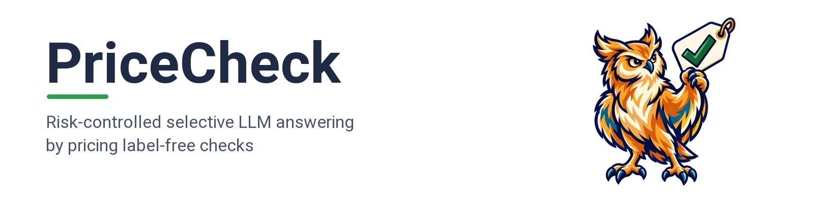
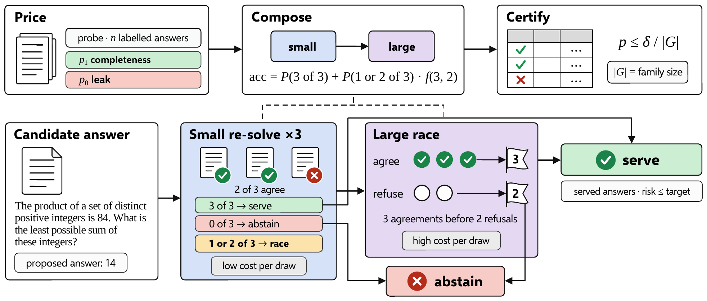
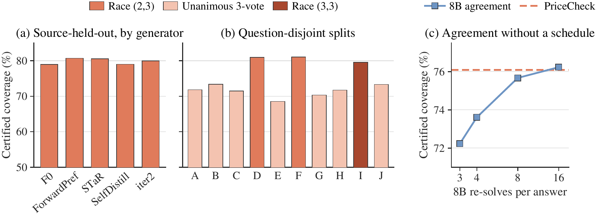

<p align="center">
  
</p>

<div align="center">

[](LICENSE)
[](https://creativecommons.org/licenses/by/4.0/)
[](https://www.python.org/)
[](https://github.com/js-lee-AI/PriceCheck/stargazers)

<b><a href="#quick-start">Quick start</a> · <a href="#usage">Usage</a> · <a href="#command-line">CLI</a> · <a href="#results">Results</a> · <a href="#reproduce-the-paper">Reproduce</a> · <a href="#faq">FAQ</a> · <a href="#citation">Citation</a></b>

</div>

---

## News

- **[2026-09-28]** Code released, together with the stored check outcomes of the paper and the scripts that rebuild its tables from them on a CPU.

## Overview

Serving an answer from a large language model means deciding when to abstain, and a verifier's ranking accuracy alone does not say how often the served answers are wrong. PriceCheck builds a compact family of answering rules from label-free checks, such as re-solving the problem, and a calibration test then picks the rule that keeps selective risk under a stated target.

PriceCheck rests on three ideas.

* **Every check has a price.** Its completeness is the rate at which it agrees with correct answers, its leak the rate at which it agrees with wrong ones, and its unit cost what one run costs. The 8B backward probe agrees with 70.1% of correct and 10.8% of wrong answers per draw (paper Table 1).
* **Prices compose into schedules.** Thresholds, unanimous votes, an adaptive race that stops at k agreements or j refusals, and cascades that pass a cheap check's undecided answers to a costlier one all get a coverage and cost predicted from the prices before they run. Over 118 diagnostic schedules, predicted and observed coverage have a rank correlation of 0.97 (paper Table 16).
* **A calibration test picks the schedule.** Every schedule in a declared family of 23 gets an exact binomial p-value against a risk above the target, with a Bonferroni correction for the family. At the primary 1.5% target the selected schedules serve 76.09% of answers on average and keep held-out risk below the target on all 15 splits (paper Table 2).

```
R(S) = P(wrong | served by S)          certify S  if  n > 0  and  F(e; n, α) ≤ δ / |G|
```

Here n is the number of calibration answers that S serves, e how many of them are wrong, F the binomial distribution function, δ = 0.05 and |G| = 23. A check reads a candidate answer and never its label, so the schedule that passes the test serves new answers with the same code.

This repository is PriceCheck as a small library, plus the stored check outcomes and the scripts that reproduce the paper.

## What it does in one picture

<p align="center">
  
</p>

<p align="center"><em>Top, the three steps. Price each check on a labelled probe, compose the prices into a schedule, and certify one schedule. Bottom, one candidate answer passing through a two-stage cascade, where green serves, red abstains and amber passes the undecided band on (paper Figure 1).</em></p>

## Quick start

```bash
pip install "git+https://github.com/js-lee-AI/PriceCheck.git"
```

```python
import pricecheck

bank = pricecheck.load_bank()                     # 2326 answers with label-free check outcomes
cal = [r for r in bank if r["source_id"] != 0]    # calibrate on four generators
test = [r for r in bank if r["source_id"] == 0]   # and serve the answers of the fifth, F0

selection = pricecheck.select(cal, alpha=0.015)   # test 23 schedules at a 1.5% risk target
print(selection)

served = pricecheck.evaluate(test, selection.max_coverage)
wrong = sum(1 - r["correct"] for r in test) / len(test)
print(f"held out  serve every answer    coverage 100.0%  risk {wrong:.2%}")
print(f"held out  PriceCheck            coverage {served['coverage']:.1%}  risk {served['risk']:.2%}")
# alpha=0.015  delta=0.05  schedules=23  calibration answers=1865
# 19 of 23 schedules pass p <= delta/23
# widest    Race (2, 3)                         coverage 80.1%  risk 0.60%  weighted tokens 13383
# cheapest  Backward probe m>=2, 1.7B           coverage 62.9%  risk 0.51%  weighted tokens 714
# held out  serve every answer    coverage 100.0%  risk 4.56%
# held out  PriceCheck            coverage 79.0%  risk 0.27%
```

This runs on a CPU in about a second and downloads nothing, because the check outcomes of the paper ship with the package. The same code is [`examples/quickstart.py`](examples/quickstart.py), and CI runs it on every push. Serving every answer of the held-out generator overshoots the 1.5% target, while the race that the test selects serves 79.0% of them at a risk of 0.27%, the F0 row of paper Table 9.

| install | adds | enough for |
|---|---|---|
| `pip install "git+https://github.com/js-lee-AI/PriceCheck.git"` | numpy, scipy | the API, the stored check outcomes, the quickstart and the `pricecheck` command |
| `git clone` and then `pip install -e ".[test]"` | pytest | `experiments/` and `tests/` |

Tested with Python 3.10, 3.11, 3.12 and 3.13, under numpy 1.26.4 with scipy 1.11.1 and under numpy 2.2 to 2.5 with scipy 1.15 to 1.18, which print identical output for every script. CI runs the tests on Python 3.10 and 3.13.

## Usage

### Select a schedule from your own check outcomes

Store one JSON row per labelled calibration answer, in the format of the shipped bank ([format](#reproduce-the-paper)).

```python
import pricecheck

cal = pricecheck.load_bank("calibration.jsonl")          # your labelled calibration answers
choice = pricecheck.select(cal, alpha=0.015, delta=0.05)
print(choice.max_coverage.label)                         # the widest schedule that passes
print([policy.label for policy in choice.certified])     # every schedule that passes

accept, tokens, weighted = pricecheck.decide(new_answer, choice.max_coverage)
```

`alpha` is the selective-risk target and `delta` the confidence budget. A schedule passes when it serves at least one calibration answer and its p-value is at most δ divided by the family size, and `select` returns the widest passing schedule together with the cheapest one whose calibration coverage is at least 0.60 (paper Section 3.3). `decide` reads the check outcomes of a new answer, never its label, and also returns the generated and parameter-weighted tokens the schedule spent on it.

### Price checks and predict a schedule before running it

```python
import pricecheck

bank = pricecheck.load_bank()
right = [r for r in bank if r["correct"]]
wrong = [r for r in bank if not r["correct"]]

# Price the 8B backward probe and the 8B re-solve vote on each class, three draws each.
probe = {1: pricecheck.fit_count_price([r["m_8b"] for r in right]),
         0: pricecheck.fit_count_price([r["m_8b"] for r in wrong])}
vote = {1: pricecheck.fit_count_price([sum(r["votes_8b"][:3]) for r in right])[0],
        0: pricecheck.fit_count_price([sum(r["votes_8b"][:3]) for r in wrong])[0]}

# Probe first, serve at 3 of 3, abstain at 0 of 3, race (2, 2) on the band.
accept = {y: pricecheck.cascade_price(*probe[y], vote[y], 2, 2, 3400, 5384)[0] for y in (1, 0)}
coverage, risk = pricecheck.coverage_risk(len(right) / len(bank), accept[1], accept[0])
print(f"predicted  coverage {coverage:.1%}  risk {risk:.2%}")

actual = pricecheck.evaluate(bank, pricecheck.Policy("casc", 2, 2))
print(f"actual     coverage {actual['coverage']:.1%}  risk {actual['risk']:.2%}")
# predicted  coverage 73.8%  risk 0.32%
# actual     coverage 71.0%  risk 0.42%
```

This is [`examples/predict_a_cascade.py`](examples/predict_a_cascade.py). Prices are good at ranking schedules by coverage and less reliable about risk, so PriceCheck uses them to decide which schedules enter the family and leaves the guarantee to the calibration test (paper Section 5).

### API at a glance

| call | what it does |
|---|---|
| `pricecheck.load_bank(path)` | reads and validates a JSONL bank of check outcomes, the shipped one by default |
| `pricecheck.select(rows, alpha, delta)` | tests every schedule on labelled calibration answers and returns the widest and the cheapest one that pass |
| `pricecheck.decide(row, schedule)` | serves or abstains on one answer, with the tokens it spent |
| `pricecheck.evaluate(rows, schedule)` | coverage, selective risk and mean cost of a schedule on labelled answers |
| `pricecheck.GRID`, `pricecheck.Policy` | the 23 deployed schedules, each with a `.label` in the paper's words |
| `pricecheck.run_main(rows)` | the 15-split main experiment behind paper Table 2 |
| `pricecheck.fit_count_price(counts)` | agreement rate and overdispersion of one check on one class |
| `pricecheck.count_tail`, `race_price`, `cascade_price`, `coverage_risk` | compose prices into acceptance, expected draws, coverage and risk |

The package needs only numpy and scipy.

## Command line

Installing the package adds a `pricecheck` command, and `python -m pricecheck` runs the same thing.

```bash
pricecheck --help
pricecheck demo                                      # the quickstart, on CPU
pricecheck certify --output results/main.json        # the 15-split main experiment
pricecheck price --data calibration.jsonl            # completeness and leak of each check
```

`pricecheck certify` replays the main experiment on the shipped bank, or on any bank passed with `--data`, and writes every split's p-values, passing schedules and held-out results to the output file.

```
target  selected  coverage  mean risk  violations  mean tokens
 0.50%   5/15      23.20%    0.000%      0       21533.2
 0.75%  12/15      57.00%    0.231%      2       19738.1
 1.00%  15/15      72.11%    0.291%      1       17388.3
 1.25%  15/15      73.85%    0.445%      0       15640.3
 1.50%  15/15      76.09%    0.430%      0       15027.9
 2.00%  15/15      78.86%    0.486%      0       13501.3
```

## Results

In mathematics, the selected schedules serve 76.1% of answers on average and keep held-out selective risk below 1.5% on all 15 splits (paper abstract).

<p align="center">
  
</p>

<p align="center"><em>Held-out coverage certified by PriceCheck at the 1.5% target on (a) source-held-out folds and (b) question-disjoint halves A to J, coloured by the selected configuration, and (c) coverage certified at 1.5% by 8B re-solve agreement over n re-solves per answer, against PriceCheck (paper Figure 2).</em></p>

### Certification under a shared protocol (paper Table 2)

Five generators fine-tuned from one 8B backbone attempted the 500 problems of MATH-500, and the 2326 answers with a complete vote bank, 99 of them wrong, are tested on five source-held-out folds and ten question-disjoint halves. Each cell gives the splits certifying, of 15, and the coverage in percent over all 15 splits, a split that certifies nothing counting as zero. The last column counts wrong answers kept at matched coverage, where lower is better.

| method | α = 0.5% | 0.75% | 1.0% | 1.25% | 1.5% | 2.0% | wrong at matched coverage |
|---|---|---|---|---|---|---|---|
| **PriceCheck (ours)** | **5** · **23.20** | **12** · **57.00** | **15** · **72.11** | **15** · **73.85** | **15** · **76.09** | **15** · 78.86 | **44** |
| Judge | 0 · 0 | 5 · 16.74 | **15** · 52.43 | **15** · 62.32 | **15** · 69.50 | **15** · 78.17 | 60 |
| Judge† | 0 · 0 | 5 · 20.09 | **15** · 61.08 | **15** · 67.99 | **15** · 71.91 | **15** · **80.81** | 60 |
| PRM | 0 · 0 | 1 · 3.31 | 5 · 16.71 | 8 · 26.77 | **15** · 55.90 | **15** · 68.14 | 97 |
| PRM† | 0 · 0 | 1 · 3.90 | 8 · 32.09 | **15** · 62.46 | **15** · 66.55 | **15** · 74.20 | 97 |
| Math-Shepherd | 0 · 0 | 0 · 0 | 0 · 0 | 0 · 0 | 1 · 3.56 | 5 · 17.52 | 164 |
| Math-Shepherd† | 0 · 0 | 0 · 0 | 0 · 0 | 0 · 0 | 2 · 7.61 | 6 · 23.80 | 164 |
| ORM | 0 · 0 | 0 · 0 | 0 · 0 | 1 · 3.47 | 3 · 10.23 | 11 · 38.63 | 195 |
| ORM† | 0 · 0 | 0 · 0 | 0 · 0 | 0 · 0 | 2 · 7.66 | 9 · 34.94 | 195 |

A dagger marks a rival family of 24 levels in place of six, and bold is best, as in the paper. Both families of a scorer keep the same wrong answers at matched coverage, since that count depends only on the ranking. `python experiments/table2_certification.py` rebuilds the PriceCheck row. The rival rows come from reward-model and judge scores that this repository does not ship.

### Prices predict schedule coverage (paper Table 16)

Prices fitted on 20 draws of 100 class-enriched answers predict every schedule of a separate diagnostic grid, and each prediction is compared with what the schedule does on the remaining answers of the pool. Errors are mean absolute values.

| quantity | 70 cascades | 118 schedules |
|---|---|---|
| Coverage error (points) | 2.97 | 3.86 |
| Coverage rank correlation | 0.99 | 0.97 |
| Risk error (points) | 0.97 | 0.95 |
| Risk bias (points) | 0.50 | 0.52 |

`python experiments/table16_price_prediction.py` rebuilds this table. Risk prediction is less reliable across schedules than coverage prediction, which is why PriceCheck certifies on calibration data instead of trusting a predicted risk.

## Reproduce the paper

```bash
git clone https://github.com/js-lee-AI/PriceCheck.git
cd PriceCheck
pip install -e ".[test]"
```

Every script reads `pricecheck/data/main_bank.jsonl`, the stored check outcomes of the paper's frozen pool. Five generators fine-tuned from Qwen3-8B-Base attempted the 500 problems of MATH-500, and the bank keeps the 2326 answers with an extractable answer and a complete vote bank, including all 99 wrong answers (paper Appendix A.1). A row holds numbers only, with no problem text, answer or model output.

```json
{"problem_id": 78, "source_id": 4, "correct": 1, "m_8b": 3, "m_4b": 3, "m_1p7b": 3, "rev_score": -0.1166, "solve_tok_8b": 1119, "solve_tok_1p7b": 1242, "votes_8b": [1, 1, 1, 1, 1, 1, 1, 1, 1, 1, 1, 1, 1, 1, 1, 1], "votes_1p7b": [1, 1, 1, 1, 1, 1, 1, 1]}
```

| field | meaning |
|---|---|
| `problem_id`, `source_id` | the problem and the generator, numbered in sorted order of their original names |
| `correct` | the stored label, 1 for a correct answer and 0 for a wrong one |
| `m_8b`, `m_4b`, `m_1p7b` | how many of the three backward-probe recoveries agree with the answer, at 8B, 4B and 1.7B |
| `rev_score` | mean token log-probability of the reverse trace, read by the score fast path |
| `votes_8b`, `votes_1p7b` | ordered re-solve verdicts, 16 at 8B and 8 at 1.7B, 1 when the re-solve agrees |
| `solve_tok_8b`, `solve_tok_1p7b` | tokens charged for one re-solve draw |

| paper | command | hardware | time |
|---|---|---|---|
| Table 1, rates and re-solve costs | `python experiments/table1_prices.py` | CPU | about 1 s |
| Table 2, PriceCheck row, with its rows in Tables 3a and 10 | `python experiments/table2_certification.py` | CPU | about 1 s |
| Table 8, modal selections and certification counts | `python experiments/table8_modal_selection.py` | CPU | about 1 s |
| Table 9, the selection on each split | `python experiments/table9_split_selection.py` | CPU | about 1 s |
| Table 12, bounds at each policy's own operating point | `python experiments/table12_risk_bounds.py` | CPU | about 1 s |
| Table 14, MATH row | `python experiments/table14_price_fit.py` | CPU | about 2 s |
| Table 16 | `python experiments/table16_price_prediction.py` | CPU | about 2 s |
| Table 19, single actions and schedules | `python experiments/table19_operating_points.py` | CPU | about 1 s |

Every script writes to `results/` and prints the rows it reproduces, and [`tests/test_paper_numbers.py`](tests/test_paper_numbers.py) checks each of them against the paper at the printed precision.

Schedules read the re-solve votes in their stored order, and certification does not average over permutations of that order. A re-solve draw with no extractable answer counts as a disagreement. Certification charges each three-draw probe a fixed 3400 tokens, while the pooled cost tables of the paper price a probe from its trace length, which the bank does not store, so the probe rows of Table 19 print no cost. The question-disjoint halves shuffle the sorted problem ids with numpy's `default_rng(seed)` and calibrate on the first half.

## Repository layout

```
pricecheck/pricing.py            prices of checks and how they compose
pricecheck/policies.py           the 23 deployed schedules and what they cost
pricecheck/certification.py      the calibration test, the two selectors and the 15 splits
pricecheck/bank.py               reads and validates a bank of check outcomes
pricecheck/data/main_bank.jsonl  the stored check outcomes of the paper
pricecheck/cli.py                the pricecheck command
examples/                        the quickstart and the pricing example shown above
experiments/                     one script per paper table
tests/                           fast CPU tests that CI runs
```

## FAQ

<details>
<summary><b>Do I need a GPU?</b></summary>

No. Everything in this repository replays stored check outcomes on a CPU, and certification itself is deterministic (paper Appendix A.11). Checking new answers means running your own generator and checks, and the paper gives the probe prompts and sampling settings in Appendix A.3 and A.4.

</details>

<details>
<summary><b>What does the calibration test guarantee?</b></summary>

With i.i.d. calibration answers from the deployment population and a family fixed independently of them, the selected schedule has selective risk at most α with probability at least 1 − δ (paper Section 3.3). Answers to the same problem are not independent, with an intraclass correlation of 0.45 on this pool, so the paper reports nominal tests together with realised held-out risk and adds problem-count bounds (paper Section 5 and Appendix D).

</details>

<details>
<summary><b>Can I use other checks, models or tasks?</b></summary>

The schedules read the fields of the shipped bank, so another check needs its outcomes in the same form or a new schedule kind in `pricecheck/policies.py`. Prices depend on the answer population and the cost model, so a new model family or task calls for refitting the prices and recalibrating on representative data (paper Appendix J).

</details>

<details>
<summary><b>Why do my numbers differ from the paper?</b></summary>

They should not for the tables listed above, which the tests check at the printed precision. The probe rows of Table 19 print no cost, because the paper prices a probe there from its trace length, which the bank does not store, while certification charges a fixed 3400 tokens per probe (paper Appendix A.7).

</details>

<details>
<summary><b>How is this different from Learn then Test?</b></summary>

PriceCheck uses the finite-family binomial test of Learn then Test ([Angelopoulos et al., 2021](https://arxiv.org/abs/2110.01052)) unchanged. What it adds is the family itself, built from priced label-free checks so that it stays small and still holds schedules that stop early or pass a cheap check's undecided answers to a costlier one.

</details>

## Citation

If you use this code, please cite the paper.

```bibtex
@article{lee2026pricecheck,
  title   = {Risk-Controlled Selective {LLM} Answering by Pricing Label-Free Checks},
  author  = {Lee, Dongyub Jude and Lee, Jungseob and Park, Chanjun and Moon, Hyeonseok and Lim, Heuiseok},
  year    = {2026}
}
```

Dongyub Jude Lee and Jungseob Lee contributed equally. The arXiv identifier is added here once it is assigned. The Cite this repository button in the GitHub sidebar gives the same entry from [`CITATION.cff`](CITATION.cff).

## License

Code is MIT, see [LICENSE](LICENSE). The paper is CC BY 4.0.

## Acknowledgments

PriceCheck certifies with the finite-family test of [Learn then Test](https://arxiv.org/abs/2110.01052). Its re-solve vote follows [self-consistency](https://arxiv.org/abs/2203.11171), its backward probe descends from [self-verification](https://doi.org/10.18653/v1/2023.findings-emnlp.167), and the answers are to problems of [MATH](https://arxiv.org/abs/2103.03874).
